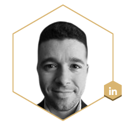
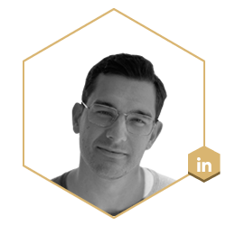
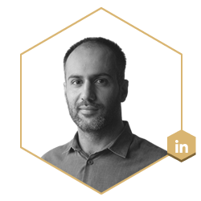

# Welcome to the Ferrum Network

### Introducing the Ferrum Network – Interoperability by Design

Ferrum Network is bringing value, data, and functional interoperability to every chain in the industry. Utilizing the Ferrum Network team's can now build and deploy solutions on one network and instantly enable multi-chain functionality without the burden or technical debt that comes with managing a multi-chain infrastructure for their dApps, and projects.

Ferrum intends to bring the power and benefits of Polkadot and its cousin Kusama to the rest of the world. Polkadot's has proven the importance and demand of their core [_HETEROGENEOUS MULTI-CHAIN FRAMEWORK_](https://polkadot.network/PolkaDotPaper.pdf)_ _with incredible adoption and a fast-growing market cap that has surpassed $35.5 Billion and is in the Top 10 coins by market cap as of 29-November-2021. Ferrum Network is bringing this amazing core technology to address the problems faced by every project in crypto with a combined potential market size to be addressed currently valued at $2.57 Trillion and growing.

### The Team

Over the last 3 years we have built highly skilled and experienced team to lead the next phase of growth for Ferrum Network. 

Ferrum Network was founded by a team of experts with a long-standing professional history in engineering and blockchain technology.

[Naiem Yeganeh](https://www.linkedin.com/in/naiem-yeganeh-12874712/), Founder at Ferrum Network

Naiem Yeganeh is a co-founder and CEO of Ferrum Network. He graduated from the University of Queensland and began a career in software engineering in 2013.

Naiem also founded Maad Afrooz Technology and has worked for the big tech companies Microsoft and Amazon. His last position before founding Ferrum Network was as core machine learning expert for Bloomberg LP.

****[**Ian Friend**](https://www.linkedin.com/in/ian-friend-bb949657/)**, Co-Founder at Ferrum Network**

Ian Friend is another co-founder of Ferrum Network. He has a degree in business law from the New York Law School and was an associate attorney for several big firms, including Pantano & Gupta and Wilson Elser.

Ian also serves as a strategic advisor for Poolz and Project Inverse. Since 2018, he has left his active duties as an attorney and turned his full attention toward the Ferrum Network.

Over the years, Ian has grown Ferrum's reach, and impact to new heights. Ian helped launch Ferrum's staking business which now serves as the staking technology powering over a 100 crypto projects. Ian successfully led the growth of this business to over 100 million ATH (All Time High) TVL (Total Value Locked).

Ian has also launched and successfully scaled the Ferrum Advisory Services Incubation division. Through this division, Ian and FAS have been instrumental in creating value of over $300 million in the space across metaverse, NFT, cross-chain and other crypto projects.

****[**Taha Abbasi**](https://www.linkedin.com/in/tahaabbasi/)**, CSO at Ferrum Network**

Taha Abbasi has extensive experience building solutions at scale. He has led teams for some of the world's most prestigious organizations like Apple, NASA's JPL Labs, National Geographic Channel and more. Along with extensive technical, and business implementation experience, Taha has a formidable education background from prestigious universities, including Harvard, MIT Sloan, and more. 

Taha founded a successful software firm and led engineering teams who helped contribute to the MARS 2020 and Europa Missions at JPL Labs with NASA, he advised and led as the Project CTO for National Geographic Channel SG, and built large-scale applications that serve millions of users worldwide. 

****[**Nichell Logue**](https://www.linkedin.com/in/nichelllogue/)**, EVP Operations at Ferrum Network**

Nichell Logue brings decades of global operations as well as brand and asset protection experience to Ferrum. Nichell has spent the last decade helping manage digital brand assets and providing brand advisory services at CSC (Corporation Service Company). CSC manages the incorporation of 90% of Fortune 500 companies. It's quite possible some of your business portfolios are managed by them. Nichell was part of the founding team of the DBS division at CSC and over her 10 year tenure Nichell was instrumental in DBS' global growth. Nichell's team was responsible for managing over $100 million in ARR for the organization.

****[**Nick Odio**](https://www.linkedin.com/in/nick-odio-176991161/)**, EVP Partnerships & Growth at Ferrum Network**

Nick Odio is a serial networker. From being heavily involved in the music industry, working with Grammy award winning artists. Nick has personally recorded music for a few Grammy award-winning artists, including Rick Ross, Chris Brown, Scott Storch, and Mario. Additionally, Nick has extensive experience in areas related to strategic partnerships, entertainment and influencer relationship management, as well as strategic initiatives.

****[**Hasnat Malik**](https://www.linkedin.com/in/hasnat-malik/)**, Lead Technical Project Manager at Ferrum Network**

Hasnat Malik is - detail to be added
