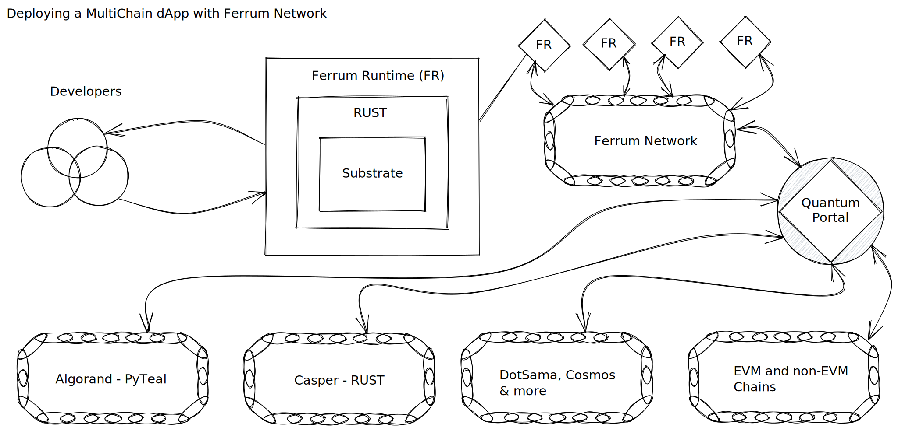

# 📐 Overview

### Background and Overview

The value proposition and use case for Ferrum's mainnet has evolved since Ferrum's inception in 2018. As the crypto landscape evolves, the team at Ferrum Network has dedicated tremendous effort to ensure that the Ferrum Network mainnet continues to adapt and evolve to provide limitless utility and value to all stakeholders.&#x20;

### Ferrum Network Tech Stack Overview

### The Core Stack

Ferrum mainnet is developed in [_RUST_](https://www.rust-lang.org/) using the [Substrate Framework](https://substrate.io/). Ferrum Network will be deployed as a parachain on the Polkadot Relay chain after securing a parachain slot through the [Polkadot Parachain Auction process](https://parachains.info/auctions). The following components make up the core tech behind Ferrum Network

1. The Chain
2. RUST programming language
3. Substrate Framework
4. Ferrum Runtime
5. Quantum Portal
6. Value Constrained PoS Rollup
7. Multi-Chain Validators

#### The Chain

Ferrum Network is a Turing complete blockchain with a smart contract-enabled platform. The chain is responsible for facilitating use cases such as the Quantum Portal, FIBER, FORGE, and limitless other use cases to be developed by Ferrum and open-source contributors in the future. The validation of transactions and their immutability is secured by the Polkadot Relay chain.&#x20;

We have made significant efforts to simplify our implementation ensuring easy extensibility and further development of the network itself as well as deployment of dApps and solutions on the network.

Before we get into the details of our core tech, let's explore why we decided to build Ferrum in the DotaSama ecosystem.
