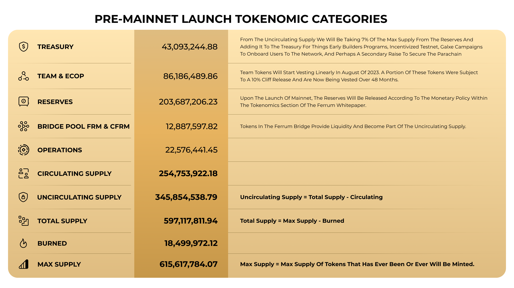

# Ferrum Testnet Node

## Introduction

Collators/Validators are members of the network that maintain the parachains they take part in. They run a full node (for both their particular parachain and the relay chain), and they produce the state transition proof for relay chain validators.

Candidates will need a minimum amount of tokens bonded (self-bonded) to be considered eligible. Along with running a validator node for the Ferrum blockchain, you can choose to run a specific type of Ferrum node, which help in validating crosschain transactions on the Ferrum Network.

The different types of nodes of the Ferrum Network:

1.  **Validator node**

    Running a validator node means you participate in the block production of the Ferrum Network. Once your validator node is up and running, you can choose to be a block producer candidate, and if you have a minimum amount of tokens, you will be selected for block production. Currently, we do not have staking or rewards for block production, but we plan to support this in the future.
2.  **Miner Node (QP Miner)**

    A miner node is responsible for mining crosschain transactions, and these nodes will observe the QP chain pairs and mine blocks on each other chains. This type of node can be run in conjunction with a validator node or independently to mine the block on the pair chain. Do note that running this node requires a minimum amount of tokens to pay for transaction costs on the pair chains.
3.  **Finalizer Node (QP Finalizer)**

    The finalizer node is responsible for finalizing the mined blocks, and these nodes will observe the mined blocks on the pair chains and finalize the block on the pair chain. This type of node can be run in conjunction with a validator node or independently to finalize the block on the pair chain. Do note that running this node requires a minimum amount of tokens to pay for transaction costs on the pair chains.
4.  **Archive Node**

    The archive node is the simplest type of node. The archive node will sync and update the latest block on the Ferrum chain. This type of node is useful to run an indexer or explorer.

## How Quantum Portal works

Quantum Portal is part of the Ferrum Runtime Node. When you deploy the Ferrum Network node, you can configure it to mine or validate Quantum Portal transactions of Ferrum Network transactions as a validator on the network.

### Overview

Quantum Portal is part of the Ferrum Runtime Node. When you deploy the Ferrum Network node, you can configure it to mine or validate Quantum Portal transactions of Ferrum Network transactions as a validator on the network.

Quantum Portal includes the following core components:

1. QP Smart Contract
2. QP Miner
3. QP Finalizer

<figure><figcaption></figcaption></figure>

### What is Quantum Portal Mining?

The QP Miners take turns based on an algorithm to create and relay these blocks from the sourceChain to the destinationChain. QP Miners do this by running the Ferrum Node as a QP Miner (QP Node). Once configured, this QP Node monitors the transactions on the network that they have set up to be miners and staked tokens on. The QP Node monitors transactions on the sourceChain and if new data is available, it creates a block every 15 seconds. After creating a block, the QP Node calls the mineRemoteBlock on the destinationChain in order to execute the transaction and mine the QP Block. It is considered a mined block after the transaction executes on the destinationChain

### What is Quantum Portal Finalization?

The QP Validators take turns based on an algorithm to pick the pending (mined but not finalized) Quantum Portal Blocks from the Quantum Portal Mined Block mempool. QP Validators do this by running the Ferrum Node as a QP Validator (QP Node). Once configured, this QP Node monitors the Quantum Portal Mined Block mempool for mined Quantum Portal Blocks, If new data is available, it creates a finalized block every 15 seconds. After creating a finalized block, the QP Node calls the finalizeRemoteBlock on the destinationChain in order to record the block as finalized and execute any remote transactions if applicable. The QP Block. It is considered a finalized block after the finalizeRemoteBlock transaction executes on the destinationChain Once mined QP Blocks are finalized, the record of the finalized mined blocks and the finalized block itself is added to the destinationChains.

### What is Quantum Portal Smart Contracts?

Quantum Portal Smart Contracts (QPSC) are Permissionless, decentralized client-side entry points designed to enable interaction with the Ferrum Network, and Quantum portal nodes to conduct sophisticated MultiChain actions. Quantum Portal smart contracts are designed to be generic by design. They are platform and chain agnostic. QPSC gives you the ability to conduct a remoteTransaction or check a remoteBalance. Quantum Portal Mart Contracts (QPSC) and Quantum Portal Node Infrastructure, along with Ferrum Network nodes, adopt and implement the XCM format developed by Polkadot. Further, Quantum Portal and Ferrum Network are backing and adopting MultiChain standards for various dApps. This includes a MultiChain token standard, MultiChain staking standard, and more.

For more details on the Ferrum Quantum Portal, refer to the whitepaper here : https://docs.ferrumnetwork.io/ferrum-network-ecosystem/architecture/core-tech/quantum-portal/overview

## Running a node

### Prerequisites

This section only applies if you are running a ferrum miner node or ferrum finalizer node. Running a QP node requires setting up the configuration for the sourcechain and destinationchain pairs, it is essential to set these values up correctly or the transactions will fail.

These are the values to be included in the file :

```json
{
    "networks": {
        "network_vec": [{
            "url": "<CHAIN_1_RPC_URL>",
            "ledger_manager": "<CHAIN_1_LEDGER_MGR_ADDRESS>",
            "id": "CHAIN_1_ID"
        },
        {
            "url": "<CHAIN_2_RPC_URL>",
            "ledger_manager": "<CHAIN_2_LEDGER_MGR_ADDRESS>",
            "id": "CHAIN_2_ID"
        }],
	    "pair_vec": [[CHAIN_1_ID, CHAIN_2_ID], [CHAIN_1_ID, CHAIN_2_ID]],
        "signer_public_key": "PUB_KEY",
        "authority_manager_contract_name" : "FERRUM_QUANTUM_PORTAL_AUTHORITY_MGR",
        "authority_manager_contract_version" : "000.010",
        "authority_manager_contract_address" : "<AUTHORITY_MGR_ADDRESS>",
        "role" : "<NODE_ROLE>"
    }
}
```

Values explained :

* The network\_vec contains the list of chains that the miner/finalizer will connect to, this should include the url of the chain, the qp ledger manager address and the chain id of the respective chain.
* signer\_public\_key contains the public key of the address you will use to sign the mine/finalize transactions, do ensure that the address has balance to execute the transactions on both chains.
* authority\_manager\_contract\_addres refers to the address of the QP authority manager contract.
* NODE\_ROLE signifies the role you choose for the node, it should be one of `QP_FINALIZER` or `QP_MINER`

An example config for mining between Mumbai testnet and BSC testnet would be as follows :

```json
{
    "networks": {
        "network_vec": [{
            "url": "https://rpc-mumbai.maticvigil.com/",
            "ledger_manager": "1AC9Fb66D542FEe49728e0da6af230dbECD6d547",
            "id": 80001
        },
        {
            "url": "https://data-seed-prebsc-2-s3.binance.org:8545",
            "ledger_manager": "1AC9Fb66D542FEe49728e0da6af230dbECD6d547",
            "id": 97
        }],
	    "pair_vec": [[80001, 97], [97, 80001]],
        "signer_public_key": "0x000000000000",
        "authority_manager_contract_name" : "FERRUM_QUANTUM_PORTAL_AUTHORITY_MGR",
        "authority_manager_contract_version" : "000.010",
        "authority_manager_contract_address" : "6036F77264bbbe1Fd601C773F21a9486313a70ec",
        "role" : "QP_MINER"
    }
}
```

Setup the config and save it to a file called `node-config.json`

### 1. Using Docker

Running a full node on a Ferrum network allows you to connect to the network, sync with a bootnode, obtain local access to RPC endpoints, author blocks on the parachain, and more.

1\. Create a local directory to store the chain data:

<pre class="language-bash"><code class="lang-bash"><strong>mkdir /var/lib/ferrum-data
</strong></code></pre>

2\. Next, make sure you set the ownership and permissions accordingly for the local directory that stores the chain data. In this case, set the necessary permissions either for a specific or current user (replace DOCKER\_USER for the actual user that will run the docker command):

<pre class="language-bash"><code class="lang-bash"><strong># chown to a specific user
</strong>chown DOCKER_USER /var/lib/ferrum-data

# chown to current user
sudo chown -R $(id -u):$(id -g) /var/lib/ferrum-data
</code></pre>

3\. Before you can start the node, you have to insert the keys, do note that this step depends on the type of node you are running

*   **For validator node**

    You need to insert the AURA key for the validator account to author blocks, this can be done using

    ```bash
    docker run --network="host" -v "/var/lib/ferrum-data:/data" \
    ferrum/ferrumx:latest \
    key insert --key-type aura --scheme Sr25519 --base-path=/data
    ```
*   **For miner/finaliser node**

    You need to insert the ofsg key for the account to sign and post transactions on the QP chains

    ```bash
    docker run --network="host" -v "/var/lib/ferrum-data:/data" \
    ferrum/ferrumx:latest \
    key insert --key-type ofsg --scheme Ecdsa --base-path=/data
    ```

4\. Now, execute the docker run command depending on your configuration :

* To run a validator node

```bash
docker run --network="host" -v "/var/lib/ferrum-data:/data" \
-u $(id -u ${USER}):$(id -g ${USER}) \
ferrum/ferrumx:latest \
--base-path=/data \
--chain alpha-testnet \
--name="YOUR-NODE-NAME" \
--validator
```

* To run a (QP) miner node

```bash
docker run --network="host" -v "/var/lib/ferrum-data:/data" \
-u $(id -u ${USER}):$(id -g ${USER}) \
ferrum/ferrumx:latest \
--base-path=/data \
--chain alpha-testnet \
--name="YOUR-NODE-NAME" \
--validator \
--config-file-path=/var/lib/node-config.json
```

* To run a (QP) finalizer node

```bash
docker run --network="host" -v "/var/lib/ferrum-data:/data" \
-u $(id -u ${USER}):$(id -g ${USER}) \
ferrum/ferrumx:latest \
--base-path=/data \
--chain alpha-testnet \
--name="YOUR-NODE-NAME" \
--validator \
--config-file-path=/var/lib/node-config.json
```

### 2. To build and run

1. Install the required dependencies to compile rust and substrate, refer the documentation here : https://docs.substrate.io/install/
2. Clone the ferrum-x-network repo

```bash
https://github.com/ferrumnet/ferrum-x-network.git
```

3\. Checkout the latest release

```bash
cd ferrum-x-network
git checkout tags/<release_version> -b <release_version>
```

For example, if the latest release is 0.0.3

```bash
git checkout tags/0.0.3 -b v0.0.3
```

You can checkout releases here : https://github.com/ferrumnet/ferrum-x-network/releases

4\. Build the binary

```
cargo build --release
```

5\. Insert the keys

* **For validators**

```bash
./target/release/ferrum-x-network key insert --key-type aura --scheme Sr25519 --base-path /var/lib/ferrum-data
```

* **For miners/finalisers**

```bash
./target/release/ferrum-x-network key insert --key-type ofsg --scheme Ecdsa --base-path /var/lib/ferrum-data
```

6\. Once the keys are inserted, you can run it using the following command

* To run a validator node

```bash
./target/release/ferrum-x-network \
--base-path=/var/lib/ferrum-data \
--chain alpha-testnet \
--name="YOUR-NODE-NAME" \
--validator
```

* To run a miner node

```bash
./target/release/ferrum-x-network \
--base-path=/var/lib/ferrum-data \
--chain alpha-testnet \
--name="YOUR-NODE-NAME" \
-config-file-path node-config.json
```

* To run a finaliser node

```bash
./target/release/ferrum-x-network \
--base-path=/var/lib/ferrum-data \
--chain alpha-testnet \
--name="YOUR-NODE-NAME" \
-config-file-path node-config.json
```

Once the node has started, your output should look similar to this

```bash
2023-01-18 23:14:46 FerrumX Node    
2023-01-18 23:14:46 ✌️  version 0.0.1-57d7936d3fa    
2023-01-18 23:14:46 ❤️  by Ferrum Network <https://github.com/ferrumnet>, 2022-2023    
2023-01-18 23:14:46 📋 Chain specification: Ferrum X Testnet    
2023-01-18 23:14:46 🏷  Node name: guttural-society-6099    
2023-01-18 23:14:46 👤 Role: AUTHORITY    
2023-01-18 23:14:46 💾 Database: RocksDb at ./chain/alice/chains/ferrum_testnet/db/full    
2023-01-18 23:14:46 ⛓  Native runtime: ferrum-x-runtime-1 (ferrum-x-runtime-1.tx1.au1)    
2023-01-18 23:14:47 Using default protocol ID "sup" because none is configured in the chain specs    
2023-01-18 23:14:47 🏷  Local node identity is: 12D3KooWSbLxDdZFBRfoxe2edM1xW4jYcyxQQNHHXvhBbJgvWjkb    
2023-01-18 23:14:47 💻 Operating system: macos    
2023-01-18 23:14:47 💻 CPU architecture: aarch64    
2023-01-18 23:14:47 📦 Highest known block at #0    
2023-01-18 23:14:47 〽️ Prometheus exporter started at 127.0.0.1:9615    
2023-01-18 23:14:47 Running JSON-RPC HTTP server: addr=127.0.0.1:9933, allowed origins=Some(["http://localhost:*", "http://127.0.0.1:*", "https://localhost:*", "https://127.0.0.1:*", "https://polkadot.js.org"])    
2023-01-18 23:14:47 Running JSON-RPC WS server: addr=127.0.0.1:9944, allowed origins=Some(["http://localhost:*", "http://127.0.0.1:*", "https://localhost:*", "https://127.0.0.1:*", "https://polkadot.js.org"])    
2023-01-18 23:14:52 💤 Idle (0 peers), best: #0 (0x6ae3…27ac), finalized #0 (0x6ae3…27ac), ⬇ 0 ⬆ 0 
```

Depending on how long the testnet has been running, your node will take a while to sync with the latest state of the network.
