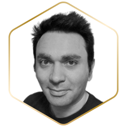
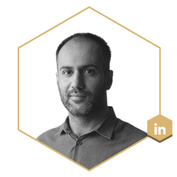

# 👥 Team

### Battle Tested, Resilient & Adaptive

Over the last 3 years we have built highly skilled and experienced team to lead the next phase of growth for Ferrum Network.&#x20;

Ferrum Network was founded by a team of experts with a long-standing professional history in engineering and blockchain technology.

****[**Naiem Yeganeh**](https://www.linkedin.com/in/naiem-yeganeh-12874712/)**, Founder at Ferrum Network**

Naiem Yeganeh is a co-founder and CEO of Ferrum Network. He graduated from the University of Queensland and began a career in software engineering in 2013.

Naiem also founded Maad Afrooz Technology and has worked for the big tech companies Microsoft and Amazon. His last position before founding Ferrum Network was as core machine learning expert for Bloomberg LP.

****[**Ian Friend**](https://www.linkedin.com/in/ian-friend-bb949657/)**, Co-Founder at Ferrum Network**

Ian Friend is another co-founder of Ferrum Network. He has a degree in business law from the New York Law School and was an associate attorney for several big firms, including Pantano & Gupta and Wilson Elser.

Ian has served as a strategic advisor for a multitude of projects across Web3. Since 2018, he has left his active duties as an attorney and turned his full attention toward the Ferrum Network.

Over the years, Ian has grown Ferrum's reach, and impact to new heights. Ian helped launch Ferrum's staking business which now serves as the staking technology powering over 200 crypto projects. Ian successfully led the growth of this business to a lifetime TVL (Total Value Locked) of $500 million.

Ian has also launched and successfully scaled the Ferrum Advisory Services (FAS) incubation division. Through this division, Ian and FAS have been instrumental in creating value of over $300 million in the space across metaverse, NFT, crosschain and other crypto projects.

****[**Taha Abbasi**](https://www.linkedin.com/in/tahaabbasi/)**, CTO at Ferrum Network**

Taha Abbasi has extensive experience building solutions at scale. He has led teams for some of the world's most prestigious organizations like Apple, NASA's JPL Labs, National Geographic Channel, and more. Along with extensive technical, and business implementation experience, Taha has a formidable education background from prestigious universities, including Harvard, MIT Sloan, and more.&#x20;

Taha founded a successful software firm and led engineering teams who helped contribute to the MARS 2020 and Europa Missions at JPL Labs with NASA. He advised and led as the Project CTO for National Geographic Channel SG, and built large-scale applications that serve millions of users worldwide.&#x20;

****[**Nick Odio**](https://www.linkedin.com/in/nick-odio-176991161/)**, Chief Growth Officer at Ferrum Network**

Nick is a serial networker. From being heavily involved in the music industry, working with Grammy award winning artists, to leading field operations divisions for companies, Nick has extensive experience in areas related to strategic partnerships and relationship management, as well as strategic initiatives.

Nick is a serial networker. From being heavily involved in the music industry, working with Grammy award winning artists, to leading field operations divisions for companies, Nick has extensive experience in areas related to strategic partnerships and relationship management, as well as strategic initiatives.

Nick Odio has been instrumental in Ferrum's growth. Nick has formed integral partnerships and helped Ferrum establish a presence by garnering interest and backing from industry leaders in the form of grants, partnerships, and capital interest. Nick continues to demonstrate an exceptional ability to stay attuned to cutting-edge innovations in crypto, providing valuable insight to the Ferrum Executive team and leadership regarding our strategic direction forward.

****[**Nichell Logue**](https://www.linkedin.com/in/nichelllogue/)**, EVP Operations at Ferrum Network**

Nichell Logue brings decades of global operations as well as brand and asset protection experience to Ferrum. Nichell has spent the last decade helping manage digital brand assets and providing brand advisory services at CSC (Corporation Service Company). CSC manages the incorporation of 90% of Fortune 500 companies. It's quite possible some of your business portfolios are managed by them. Nichell was part of the founding team of the DBS division at CSC, and over her 10-year tenure, Nichell was instrumental in DBS' global growth. Nichell's team was responsible for managing over $100 million in ARR for the organization.

****[**Hasnat Malik**](https://www.linkedin.com/in/hasnat-malik/)**, Director of Projects at Ferrum Network**

