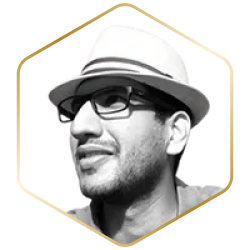

# 👥 Team

## Battle Tested, Resilient & Adaptive

Over the last 3 years**,** we have built a highly skilled and experienced team to lead the next phase of growth for Ferrum Network.&#x20;

Ferrum Network was founded by a team of experts with a long-standing professional history in engineering and blockchain technology.

<figure><figcaption>
Naiem Yeganeh, Founding Team Member at Ferrum Labs
</figcaption></figure>

## [**Naiem Yeganeh**](https://www.linkedin.com/in/naiem-yeganeh-12874712/)**,** Founding Team Member, Senior Contributing Engineer

Naiem Yeganeh is a co-founder of Ferrum Network. He graduated from the University of Queensland and began a career in software engineering in 2013.

Naiem also founded Maad Afrooz Technology and has worked for the big tech companies Microsoft and Amazon. His last position before founding Ferrum Network was as core machine learning expert for Bloomberg LP.

<figure><figcaption>
Taha Abbasi, CTO at Ferrum Labs
</figcaption></figure>

## [**Taha Abbasi**](https://www.linkedin.com/in/tahaabbasi/)**,** Founding Team Member, CTO at Ferrum Labs

Taha Abbasi has extensive experience building solutions at scale for some of the world’s most prestigious organizations, including NASA’s JPL Labs, Apple, and National Geographic Channel. He has a strong educational background from Harvard, MIT Sloan, and other prestigious institutions, focusing on human-centered product and system design. Taha founded a successful software firm and led engineering teams that contributed to the Mars 2020 and Europa missions at JPL.&#x20;

As an Executive Officer at Ferrum Labs, Taha leads the architecture and development of Ferrum’s sophisticated interoperability systems, including cross-chain communication, liquidity aggregation, and asset transfer mechanisms. He is the author of the Ferrum Network Protocol Whitepaper and the inventor of OmniChain Liquidity, guiding the Ferrum team in building a more approachable Web3 ecosystem for consumers. His extensive technical knowledge and business expertise, combined with his experience in managing DNS systems for Fortune 500 companies at CSC, uniquely position him to lead Ferrum into the future of decentralized infrastructure.

<figure><figcaption>
Nick Odio, Chief Growth Officer at Ferrum Labs
</figcaption></figure>

## [**Nick Odio**](https://www.linkedin.com/in/nick-odio-176991161/)**,** Founding Team Member, Chief Growth Officer (CGO) at Ferrum Labs

Nick Odio is a serial networker with an extensive background in music and field operations management, working with Grammy Award-winning artists and leading operations for multiple companies. At Ferrum, Nick has played a critical role in forming key partnerships, securing over $1 million in grants and revenue from Layer 1, Layer 2, and Layer 3 integrations. Nick has been instrumental in building the Iron Alliance, a group of over two dozen leading organizations using Ferrum technology. His strategic networking skills ensure Ferrum’s growth and its continued integration across the Web3 ecosystem.

## [**Nichell Logue**](https://www.linkedin.com/in/nichelllogue/)**,** Founding Team Member, Chief Operating Officer (COO) at Ferrum Labs

<figure><figcaption>
Nichell Logue, EVP Operations at <a href="https://ferrum.network/">Ferrum Network</a>
</figcaption></figure>

Nichell Logue brings over a decade of global operations and brand protection experience to Ferrum, alongside 4 years of experience scaling Web3 companies. At Ferrum Labs, Nichell has been instrumental in scaling operations for the past 4 years, advising nearly three dozen organizations on strategies for operations, fund management, community management, and personnel management, all within the Web3 space.&#x20;

She has also developed relationships with key Web3 vendors to optimize costs and establish growth strategies for integration. Nichell’s background at CSC’s Digital Brand Services division, where she helped manage over $100 million in ARR (annual recurring revenue) and served 90% of Fortune 500 companies, further complements her extensive Web3 experience. Her combination of traditional internet infrastructure expertise and Web3 operational leadership makes her a vital asset in building Ferrum’s vision of “The Blockchain.”

<figure><figcaption>
Hasnat Malik, Director of Projects at <a href="https://ferrum.network/">Ferrum Network</a>
</figcaption></figure>

## [**Hasnat Malik**](https://www.linkedin.com/in/hasnat-malik/)**,** Founding Team Member, Director of Projects at Ferrum Labs

Hasnat Malik is a resourceful and professional individual with 12 years of experience leading the development of innovative services and products across Web2 and Web3. Before transitioning to Web3 four years ago, Hasnat developed software for hundreds of Web2 teams and has since worked with dozens of Web3 projects. Hasnat’s passion for building relationships and delivering exceptional customer service drives his work, making him an invaluable leader in overseeing Ferrum’s project development. His extensive expertise allows him to guide teams in achieving their goals while driving innovation across Ferrum’s product offerings.
